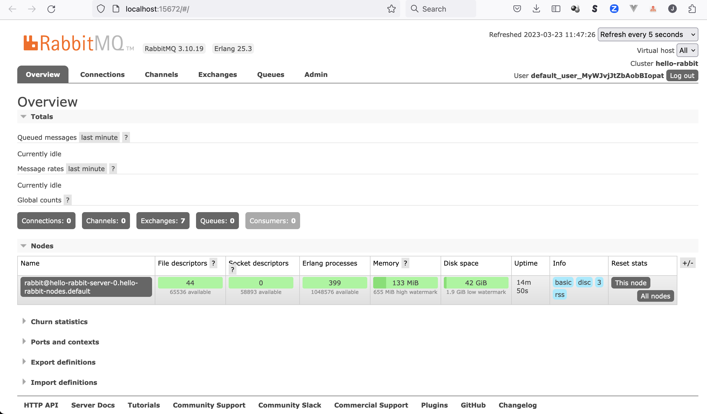
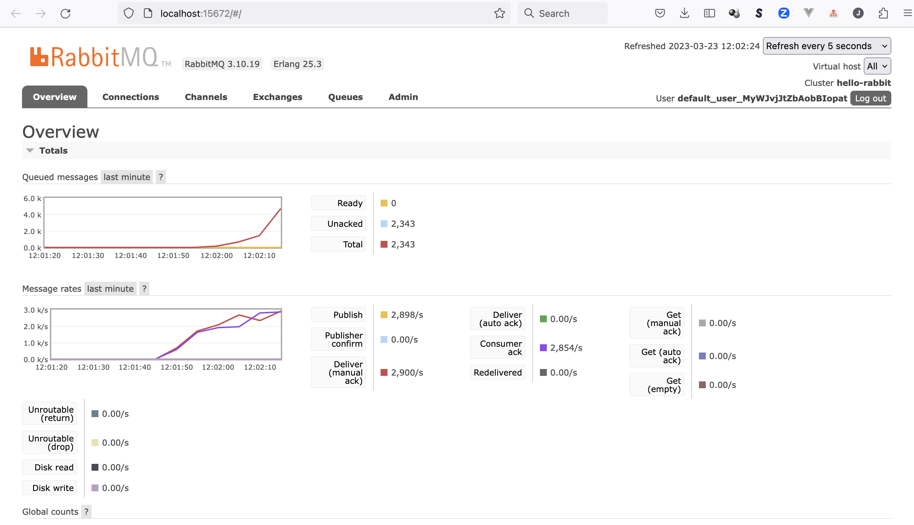

# rabbitmq-microk8s
[](https://github.com/jonashackt/rabbitmq-microk8s/actions)
[](https://github.com/jonashackt/rabbitmq-microk8s/blob/main/LICENSE)
[](https://renovatebot.com)
[](https://kustomize.io/)

Example project showing how to run RabbitMQ on MicroK8s


# Setup MicroK8s

## Install MicroK8s

On Linux - especially Ubuntu - installation of MicroK8s is super easy: https://microk8s.io/docs/getting-started

If you're on a Mac, then [the following steps apply](https://microk8s.io/docs/install-macos):

```shell
brew install ubuntu/microk8s/microk8s
```

On MacOS MicroK8s is based on [Multipass](https://multipass.run/), which manages and runs Ubuntu VMs on every OS' native hypervisor (for Mac this is QEMU and HyperKit). So the next command will prompt you to download & install Multipass:

```shell
microk8s install
```

After successfull completion there should be something printed something like this:

```shell
2023-03-22T09:13:05+01:00 INFO Waiting for automatic snapd restart...
microk8s (1.26/stable) v1.26.1 from Canonical✓ installed
microk8s-integrator-macos 0.1 from Canonical✓ installed
MicroK8s is up and running. See the available commands with `microk8s --help`.
```

You can even log into the Multipass vm via:

```shell
multipass shell microk8s-vm
```

## Access MicroK8s

> MicroK8s bundles its own version of kubectl for accessing Kubernetes.

Just checking:

```shell
microk8s kubectl get nodes
```

This works, but you may want to use your own `kubectl` including [kubectx or kubens](https://github.com/ahmetb/kubectx) and [k9s](https://k9scli.io/). This is also possible (see https://microk8s.io/docs/working-with-kubectl).

First output the `kubeconfig` with:

```shell
microk8s config
```

If you don't have a K8s cluster configured, you can copy the output directly into your K8s config

```shell
mkdir ~/.kube
microk8s config > ~/.kube/config
```

> If you have already configured other Kubernetes clusters, __you should merge the output from the microk8s config with the existing config__ 

Watch out for existing lines like:

```shell
apiVersion: v1
clusters:
## and
contexts:
## and 
current-context: xyz-cluster
## and
kind: Config
preferences: {}
users:
```

You shouldn't override them!


## Enable MicroK8s Addons

At first have a look at the already enabled addons in MicroK8s:

```shell
microk8s status
```

Only the following addons are pre-installed in MicroK8s:
    api-server
    controller-manager
    scheduler
    kubelet
    cni
    kube-proxy

> While this does deliver a pure Kubernetes experience with the smallest resource footprint possible, there are situations where you may require additional services. MicroK8s caters for this with the concept of “Addons” - extra services which can easily be added to MicroK8s. These addons can be enabled and disabled at any time, and most are pre-configured to ‘just work’ without any further set up.

To get more functionalities see https://microk8s.io/docs/addons for the full list of addons

In order to have a simple solution for `PersistenVolumes` our RabbitMQ cluster needs, we should enable the `hostpath-storage` addon:

```shell
microk8s enable hostpath-storage dns
```

> The hostpath storage MicroK8s add-on can be used to easily provision PersistentVolumes backed by a host directory. It is ideal for local development

Also we [should enable DNS](https://microk8s.io/docs/addon-dns) to prevent the following error:

```shell
  Warning  MissingClusterDNS  10s (x4 over 35s)  kubelet            pod: "hello-rabbit-server-0_default(c506abbb-68bf-4582-b288-fd4a2a3dc0c5)". kubelet does not have ClusterDNS IP configured and cannot create Pod using "ClusterFirst" policy. Falling back to "Default" policy.
```


# RabbitMQ


## Install RabbitMQ cluster operator

We want to check out the RabbitMQ operator:

https://operatorhub.io/operator/rabbitmq-cluster-operator

There's a great quickstart guide covering all the steps we need:

https://www.rabbitmq.com/kubernetes/operator/quickstart-operator.html


### 0. Install rabbitmq kubectl plugin via krew

Luckily there's a RabbitMQ kubectl plugin which will make working with RabbitMQ on Kubernetes much easier.

To install it we need to have [`krew` - the package manager for kubectl plugins](https://github.com/kubernetes-sigs/krew) in place. If you don't already have it installed, take [the following steps on a Mac](https://krew.sigs.k8s.io/docs/user-guide/setup/install/) (see the [docs for other OSses]https://krew.sigs.k8s.io/docs/user-guide/setup/install/)):

```shell
(
  set -x; cd "$(mktemp -d)" &&
  OS="$(uname | tr '[:upper:]' '[:lower:]')" &&
  ARCH="$(uname -m | sed -e 's/x86_64/amd64/' -e 's/\(arm\)\(64\)\?.*/\1\2/' -e 's/aarch64$/arm64/')" &&
  KREW="krew-${OS}_${ARCH}" &&
  curl -fsSLO "https://github.com/kubernetes-sigs/krew/releases/latest/download/${KREW}.tar.gz" &&
  tar zxvf "${KREW}.tar.gz" &&
  ./"${KREW}" install krew
)
```

Then add the following line to your `.bashrc` or `.zshrc`:

```shell
export PATH="${KREW_ROOT:-$HOME/.krew}/bin:$PATH"
```

Now `kubectl krew` should be ready to use!

Finally install the rabbitmq kubectl plugin with:

```shell
kubectl krew install rabbitmq
```


### 1. Install the RabbitMQ cluster operator Helm

In the docs https://www.rabbitmq.com/kubernetes/operator/install-operator.html#helm-chart there is a reference to the bitnami Helm chart https://bitnami.com/stack/rabbitmq-cluster-operator/helm. We can install it using our own custom `Chart.yaml` to pin the version ([as described here](https://stackoverflow.com/questions/71765471/helm-how-to-pin-version-make-it-manageable-by-renovate-on-github/71765472#71765472)) in order to make this managable via Renovate bot. The `Chart.yaml` resides in `rabbitmq/install`:

```yaml
apiVersion: v2
type: application
name: rabbitmq-cluster-operator
version: 0.0.0 # unused
appVersion: 0.0.0 # unused
dependencies:
  - name: rabbitmq-cluster-operator
    repository: https://charts.bitnami.com/bitnami
    version: 3.2.7
```

Now we can install the RabbitMQ cluster operator with the following commands:

```shell
helm dependency update rabbitmq/install
helm upgrade -i rabbitmq-cluster-operator rabbitmq/install
```


### 2. Watch operator starting up

```shell
kubectl wait --for=condition=Ready pod -l app.kubernetes.io/name=rabbitmq-cluster-operator,app.kubernetes.io/instance=rabbitmq-cluster-operator --namespace default --timeout=120s
```


## Create RabbitMQ Cluster

### 1. Craft RabbitmqCluster CRD

As https://www.rabbitmq.com/kubernetes/operator/quickstart-operator.html suggests we can now start creating our first hello world RabbitMQ cluster using the `RabbitmqCluster` CRD:

```yaml
apiVersion: rabbitmq.com/v1beta1
kind: RabbitmqCluster
metadata:
    name: hello-rabbit
```

See the following examples https://github.com/rabbitmq/cluster-operator/tree/main/docs/examples/ to enhance the setup for TLS, production defaults and more.


### 2. Install CRS via Kustomize

The [K8s config management tool Kustomize](https://kustomize.io/) helps us installing our CRD. First we need to create a [kustomization.yaml](rabbitmq/kustomization.yaml):

```yaml
apiVersion: kustomize.config.k8s.io/v1beta1
kind: Kustomization

resources:
  - hello-rabbit.yaml
```

Now we can simply install the CRD into our cluster via:

```shell
kubectl apply -k rabbitmq
```

Watch things coming up with

```shell
watch kubectl get all
```

To debug your setup use the following and have a look into the Events:

```shell
kubectl describe po hello-rabbit-server-0
```

Or try one of the following hints

```shell
# view CRD status
kubectl get rabbitmqclusters.rabbitmq.com

# view logs
kubectl logs hello-world-server-0
```


### Tackling Readiness probe failed: dial tcp 10.1.254.78:5672: connect: connection refused

```shell
Events:
  Type     Reason     Age   From               Message
  ----     ------     ----  ----               -------
  Normal   Scheduled  53s   default-scheduler  Successfully assigned default/hello-rabbit-server-0 to microk8s-vm
  Normal   Pulled     52s   kubelet            Container image "docker.io/bitnami/rabbitmq:3.10.19-debian-11-r4" already present on machine
  Normal   Created    52s   kubelet            Created container setup-container
  Normal   Started    52s   kubelet            Started container setup-container
  Normal   Pulled     21s   kubelet            Container image "docker.io/bitnami/rabbitmq:3.10.19-debian-11-r4" already present on machine
  Normal   Created    21s   kubelet            Created container rabbitmq
  Normal   Started    21s   kubelet            Started container rabbitmq
  Warning  Unhealthy  3s    kubelet            Readiness probe failed: dial tcp 10.1.254.78:5672: connect: connection refused
```

Seems that we don't get a connection https://stackoverflow.com/questions/74538398/k8s-readiness-probes-working-in-gke-not-in-microk8s-on-macos

All we need to do is to enable [the `host-access` plugin](https://microk8s.io/docs/addon-host-access) in Microk8s (see [this so answer](https://stackoverflow.com/a/75821978/4964553)):

```shell
microk8s enable host-access
```


## Access the RabbitMQ management UI

Extract the `username` and `password` prior to accessing the management UI via:

```shell
username="$(kubectl get secret hello-rabbit-default-user -o jsonpath='{.data.username}' | base64 --decode)"
echo "username: $username"
password="$(kubectl get secret hello-rabbit-default-user -o jsonpath='{.data.password}' | base64 --decode)"
echo "password: $password"
```

Now create a port forwarding and open your Browser at http://localhost:15672:

```shell
kubectl port-forward "service/hello-rabbit" 15672

# or use rabbitmq kubectl plugin
kubectl rabbitmq manage hello-rabbit
```

> If you don't want to block your terminal, you can enhance the command by only running it in the background using a trailing `&` like this: `kubectl port-forward "service/hello-rabbit" 15672 &`. Now your terminal remains usable. If you want to stop the port forward though, you need to search for the process id via `ps -eaf | grep port-forward` and kill the second number in the first line like this:

```shell
ps -eaf | grep port-forward
  501 86828 27857   0  2:33pm ttys004    0:00.20 kubectl port-forward service/hello-rabbit 15672
  501 88299 27857   0  2:39pm ttys004    0:00.00 grep --color=auto --exclude-dir=.bzr --exclude-dir=CVS --exclude-dir=.git --exclude-dir=.hg --exclude-dir=.svn port-forward
$ kill 86828
[1]  + 86828 terminated  kubectl port-forward "service/hello-rabbit" 15672
```

Finally the management UI should be available to us:




## Connecting an app to the cluster using perf-test load testing library

There's a great load testing application https://github.com/rabbitmq/rabbitmq-perf-test which is broadly used to test RabbitMQ installs. You can run it via the following commands:

```shell
username="$(kubectl get secret hello-rabbit-default-user -o jsonpath='{.data.username}' | base64 --decode)"
password="$(kubectl get secret hello-rabbit-default-user -o jsonpath='{.data.password}' | base64 --decode)"
service="$(kubectl get service hello-rabbit -o jsonpath='{.spec.clusterIP}')"

kubectl run perf-test --image=pivotalrabbitmq/perf-test -- --uri amqp://$username:$password@$service
```

Now follow the logs with

```shell
kubectl logs --follow perf-test
```

Now you can see the messages also flowing inside the management ui:



But remember to stop the performance test again! Because 

> perf-test is able to produce and consume about 25,000 messages per second.

So this will really get your cluster to the limits :)

Stop it with

```shell
kubectl delete po perf-test

# or if you used the rabbitmq kubectl command
kubectl delete job.batch perf-test
```


# Doing it all with GitHub Actions

We simply use https://github.com/marketplace/actions/microk8s-action to get Microk8s installed incl. our needed addons.

See [provision.yml](.github/workflows/provision.yml):

```yaml
name: provision

on: [push]

jobs:
  microk8s-rabbitmq:
    runs-on: ubuntu-latest
    steps:
      - name: Checkout
        uses: actions/checkout@master

      - name: Install microk8s using actions/microk8s-action
        uses: balchua/microk8s-actions@v0.3.0
        with:
          channel: '1.26/stable'
          addons: '["dns", "host-access", "hostpath-storage"]'

      - name: Access microk8s
        run: |
          echo "Check access to mikrok8s cluster"
          kubectl get nodes
      
      - name: Install RabbitMQ cluster operator
        run: |
          echo "Install RabbitMQ using our Helm chart with pinned version"
          helm dependency update rabbitmq/install
          helm upgrade -i rabbitmq-cluster-operator rabbitmq/install

          echo "Watch operator starting up - wrapped in until to prevent 'error: no matching resources found' from stopping the pipeline"
          until kubectl wait --for=condition=Ready pod -l app.kubernetes.io/name=rabbitmq-cluster-operator,app.kubernetes.io/instance=rabbitmq-cluster-operator --namespace default --timeout=120s; do : ; sleep 5; done

      - name: Install RabbitMQ
        run: |
          echo "Install CRDs via Kustomize"
          kubectl apply -k rabbitmq

          echo "Watch RabbitMQ coming up - wrapped in until to prevent 'error: no matching resources found' from stopping the pipeline"
          until kubectl wait --for=condition=Ready pod -l app.kubernetes.io/name=hello-rabbit --namespace default --timeout=120s; do : ; sleep 5; done

      - name: Check if the RabbitMQ management UI is accessible
        run: |
          echo "Extract username and password for RabbitMQ management UI"
          username="$(kubectl get secret hello-rabbit-default-user -o jsonpath='{.data.username}' | base64 --decode)"
          password="$(kubectl get secret hello-rabbit-default-user -o jsonpath='{.data.password}' | base64 --decode)"

          echo "Create port forwarding to the management UI (in background using '&' at the end to not block the terminal session)"
          kubectl port-forward "service/hello-rabbit" 15672 &

          echo "Access the management UI via curl"
          until curl -u$username:$password localhost:15672/api/overview --connect-timeout 30; do : ; sleep 3; done
```


# Links

https://www.infracloud.io/blogs/setup-rabbitmq-ha-mode-kubernetes-operator/